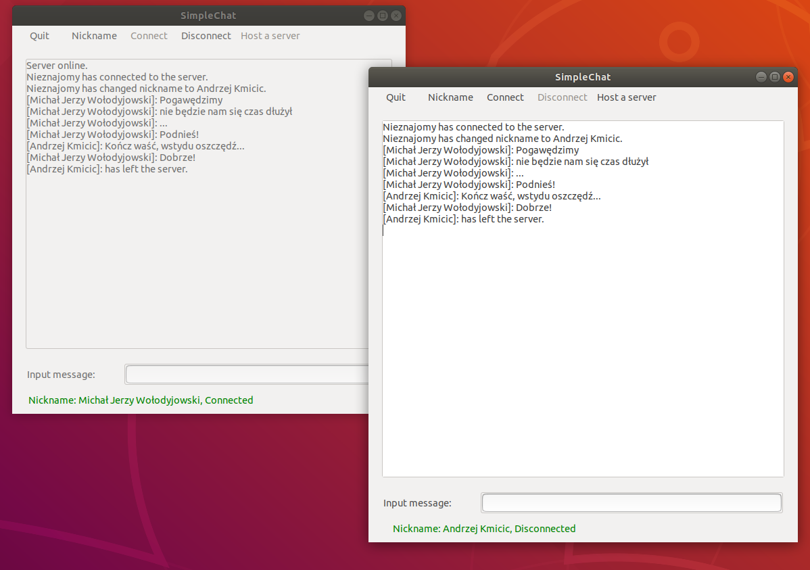

# SimpleChat
A minimal sockets-based chat application. Can set up chat servers, connect to them and send text messages.

This software is written with GTK, Socket API and pthread libraries. 

It uses port 6660 (standard IRC port) as the communication port.

Here is an example of the app window:

